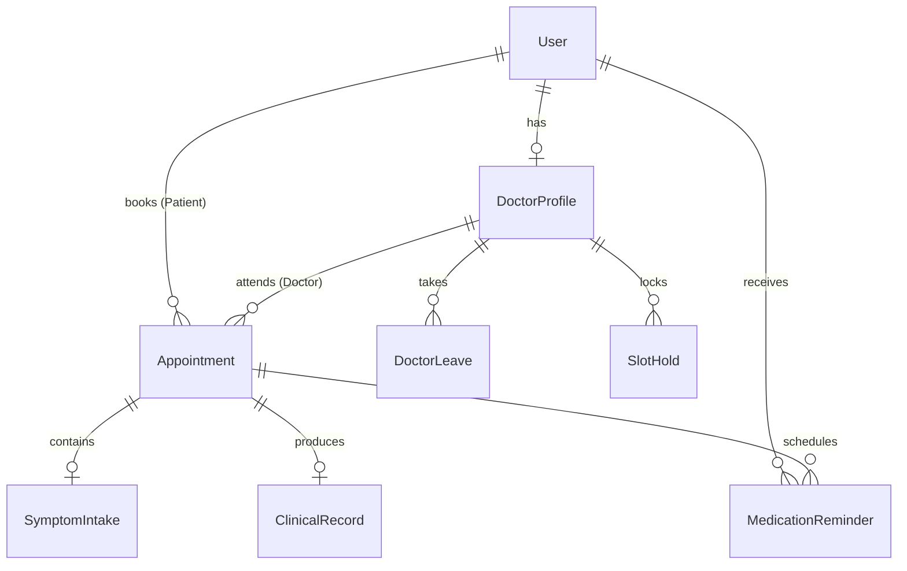

# AuraHealth AI — Healthcare Appointment & Follow-up Manager

[](https://aurahealth-client.onrender.com/)
[](https://aurahealth-ai-fwkw.onrender.com/api/health)
[](https://opensource.org/licenses/MIT)

> **AuraHealth AI** is a production-grade healthcare appointment and automated follow-up platform engineered with **concurrency-safe slot locking (5-minute TTL holds)**, **automated doctor leave conflict resolution**, **AI pre-visit symptom triage**, **patient-friendly post-visit care plans**, and **cron-driven medication adherence reminders**.

---

## 🌐 Live Deployed Application URLs

- 🖥️ **Live Web Application (Frontend):** [https://aurahealth-client.onrender.com/](https://aurahealth-client.onrender.com/)
- ⚙️ **Production REST API (Backend):** [https://aurahealth-ai-fwkw.onrender.com/](https://aurahealth-ai-fwkw.onrender.com/)
- 🏥 **API Health Telemetry Endpoint:** [https://aurahealth-ai-fwkw.onrender.com/api/health](https://aurahealth-ai-fwkw.onrender.com/api/health)
- 📄 **System Design Write-Up ($\le 800$ Words):** [SYSTEM_DESIGN.md](https://github.com/ashutosh-dev-hub/aurahealth-ai/blob/main/SYSTEM_DESIGN.md)

---

## 🌟 Key Capabilities & Architectural Highlights

1. **Role-Based Portals (RBAC)**:
   - **Patient Portal**: Doctor discovery, interactive slot picker with real-time hold timers, symptom intake wizard, appointment management, digital care plans, and medication reminder tracker.
   - **Doctor Portal**: Consultation queue, pre-visit AI dossiers with urgency triage (Low/Medium/High) and 3 diagnostic questions, clinical examination notes, structured prescription builder, and leave scheduling.
   - **Admin Portal**: Operational telemetry hub (patient/doctor metrics, urgency distribution, appointment status), doctor profile onboarding, leave conflict monitor, and system email audit logs.

2. **Concurrency-Safe Slot Holds (No Double-Booking)**:
   - Atomic reservation lock (`SlotHold`) with a 5-minute TTL preventing simultaneous booking collisions.
   - All booking commitments execute inside serializable database transactions (`prisma.$transaction`).

3. **Doctor Leave Conflict Engine**:
   - Marking doctor leaves automatically identifies overlapping consultations, shifts status to `RESCHEDULE_REQUIRED`, and notifies patients with 1-click priority reschedule links.

4. **Dual-Stage AI Pipeline with Resilient Fallback**:
   - Supports Google Gemini API & OpenAI API.
   - Built-in **Deterministic Clinical Heuristic Engine** ensures 100% uptime even without API keys.

5. **Automated Cron Jobs & Adherence Engine**:
   - Converts prescription frequency (`once_daily`, `twice_daily`, `thrice_daily`, `every_8_hours`) into scheduled medication dose alerts.
   - Sweeps expired slot holds every 30 seconds.
   - Automated 24-hour appointment reminders and exponential backoff email retries.

6. **Google Calendar & RFC 5545 iCalendar Sync**:
   - Google Calendar OAuth 2.0 integration + downloadable `.ics` calendar files with virtual meeting links.

---

## 📋 Demo Login Credentials (Instant Evaluator Access)

| Role | Email | Password | Details |
| :--- | :--- | :--- | :--- |
| 👑 **Chief Admin** | `admin@aurahealth.ai` | `Admin@123` | Hospital Telemetry, Doctor Management, Notification Logs |
| 🩺 **Doctor** | `dr.sarah@aurahealth.ai` | `Password@123` | Cardiology Specialist (12 Yrs Exp, $120/hr) |
| 🩺 **Doctor** | `dr.marcus@aurahealth.ai` | `Password@123` | Neurology Specialist (9 Yrs Exp, $140/hr) |
| 🩺 **Doctor** | `dr.elena@aurahealth.ai` | `Password@123` | Pediatrics & Family Medicine ($85/hr) |
| 👤 **Patient** | `patient.john@aurahealth.ai` | `Password@123` | Patient with completed past visit & active medication plan |
| 👤 **Patient** | `patient.emma@aurahealth.ai` | `Password@123` | Patient with upcoming high-urgency consultation |

> 💡 **Tip:** The application features a **"1-Click Demo Switcher"** in the top navigation bar and login screen to effortlessly test any role without typing passwords.

---

## 🚀 Quickstart Guide (Local Development)

### Prerequisites
- Node.js `v18+` or `v20+`
- npm `v9+` or `v10+`

### 1. Clone & Install Dependencies
```bash
# Clone the repository
git clone https://github.com/ashutosh-dev-hub/aurahealth-ai.git
cd aurahealth-ai

# Install root dependencies
npm install

# Install server and client packages
npm --prefix server install
npm --prefix client install
```

### 2. Initialize Database & Seed Demo Data
```bash
# Push Prisma schema to SQLite and run the comprehensive seeder
npm run db:setup
npm run db:seed
```

### 3. Run Application Locally
```bash
# Start both backend (Port 5000) and frontend (Port 5173) concurrently:
npm run dev
```

- **Frontend Client:** [http://localhost:5173](http://localhost:5173)
- **Backend API:** [http://localhost:5000](http://localhost:5000)
- **API Health Check:** [http://localhost:5000/api/health](http://localhost:5000/api/health)

---

## 🧪 Concurrency Stress Testing

An automated concurrency stress test script is included to validate that simultaneous requests for the exact same slot cannot produce double-bookings:

```bash
npm run test:concurrency
```

**Expected Output:**
```
⚡ Starting AuraHealth Concurrency Double-Booking Prevention Stress Test...
🎯 Target Doctor: Dr. Sarah Jenkins, MD
⏰ Target Slot: 2026-10-15T11:00:00.000Z
🚀 Firing 10 simultaneous concurrent booking requests...

--- 📊 STRESS TEST RESULTS ---
Attempt #01: 🛡️ BLOCKED (DOUBLE_BOOKING_PREVENTED)
Attempt #02: 🛡️ BLOCKED (DOUBLE_BOOKING_PREVENTED)
Attempt #03: ✅ SUCCESS (Booked Slot)
Attempt #04: 🛡️ BLOCKED (DOUBLE_BOOKING_PREVENTED)
...
Total Requests: 10
Successful Bookings: 1 (Expected: 1)
Safely Blocked Conflicts: 9 (Expected: 9)

🎉 PASS: Strict transaction isolation and concurrency protection passed with 100% accuracy!
```

---

## ⚙️ Environment Configuration (`server/.env`)

```ini
PORT=5000
DATABASE_URL="file:./dev.db"
JWT_SECRET="aurahealth_ultra_secure_jwt_token_secret_key_2026"
CLIENT_URL="http://localhost:5173"

# Optional: Google Gemini or OpenAI API (Falls back gracefully to clinical heuristic engine if unconfigured)
GEMINI_API_KEY=
OPENAI_API_KEY=

# Email Transporter (Defaults to Ethereal / Simulated JSON stream when empty)
SMTP_HOST=smtp.ethereal.email
SMTP_PORT=587
SMTP_USER=
SMTP_PASS=
SMTP_FROM="AuraHealth AI <appointments@aurahealth.ai>"

# Google Calendar OAuth 2.0 (Optional: fallback RFC 5545 .ics generated automatically)
GOOGLE_CLIENT_ID=
GOOGLE_CLIENT_SECRET=
GOOGLE_REDIRECT_URI=http://localhost:5000/api/auth/google/callback
```

---

## 🤖 LLM Prompts & Engineering Architecture

### 1. Pre-Visit Symptom Triage Prompt
```text
You are an expert AI clinical triage assistant.
Analyse these symptoms and return: urgency level (Low / Medium / High), chief complaint, and three suggested questions for the doctor.
Symptoms: <symptoms>
Duration: <duration>

Respond ONLY with valid JSON in this exact structure without markdown or backticks:
{
  "urgencyLevel": "LOW" | "MEDIUM" | "HIGH",
  "chiefComplaint": "Concise 1-sentence summary of the main issue",
  "suggestedQuestions": [
    "Diagnostic question 1",
    "Diagnostic question 2",
    "Diagnostic question 3"
  ]
}
```

### 2. Post-Visit Patient Care Plan Prompt
```text
You are an empathetic medical communicator.
Convert these clinical notes into a patient-friendly summary with medication schedule and follow-up steps:
Diagnosis: <diagnosis>
Clinical Notes: <clinicalNotes>
Prescriptions: <prescriptionsJson>
Follow-up Date: <followUpDate>

Write in clear, compassionate, easy-to-understand language. Format with clear Markdown headings for Summary, Medications, and Follow-up Precautions.
```

---

## 📡 API Reference Overview

### Authentication (`/api/auth`)
- `POST /api/auth/register` — Register Patient or Doctor
- `POST /api/auth/login` — Login & receive JWT
- `GET /api/auth/me` — Verify session and load profile

### Doctors (`/api/doctors`)
- `GET /api/doctors` — Search doctors by name, bio, or specialization
- `GET /api/doctors/:id` — Get doctor dossier
- `GET /api/doctors/:id/slots?date=YYYY-MM-DD` — Compute real-time slots (checking working hours, leaves, booked appointments, and active holds)
- `PUT /api/doctors/profile` — Update doctor clinical profile
- `PUT /api/doctors/working-hours` — Update weekly shift schedule

### Appointments (`/api/appointments`)
- `POST /api/appointments/hold` — Acquire 5-minute exclusive hold on slot
- `POST /api/appointments/book` — Confirm booking with AI intake & calendar generation
- `GET /api/appointments` — Query appointments (filtered by patient/doctor role)
- `GET /api/appointments/:id` — Full consultation details & AI dossier
- `POST /api/appointments/:id/cancel` — Cancel appointment & notify counterpart

### Clinical Consultation (`/api/consultations`)
- `POST /api/consultations/record` — Doctor submits notes & prescriptions; generates AI summary & schedules medication reminders

### Doctor Leaves (`/api/leaves`)
- `POST /api/leaves` — Register doctor leave; auto-detects conflicting appointments and triggers patient notification queue
- `GET /api/leaves` — List active & past leaves

### Medication Tracker (`/api/medications`)
- `GET /api/medications` — Patient's scheduled medication dose reminders
- `POST /api/medications/:id/acknowledge` — Mark dose as taken

### Admin Center (`/api/admin`)
- `GET /api/admin/stats` — Hospital metrics, urgency distribution, and appointment breakdown
- `POST /api/admin/doctors` — Onboard new doctor profile
- `GET /api/admin/notifications` — Audit system email delivery logs

---

## 📅 Google Calendar OAuth 2.0 Setup Steps

1. Go to the [Google Cloud Console](https://console.cloud.google.com/).
2. Create a new project named `AuraHealth-AI`.
3. Navigate to **APIs & Services** > **Library** and enable **Google Calendar API**.
4. Configure the **OAuth Consent Screen** (User Type: External, add test emails).
5. Go to **Credentials** > **Create Credentials** > **OAuth Client ID** (Web application).
6. Add Authorized Redirect URI: `http://localhost:5000/api/auth/google/callback`.
7. Copy the **Client ID** and **Client Secret** into your `server/.env` file.
8. *(Optional)* When credentials are not provided, AuraHealth AI generates standard RFC 5545 `.ics` invites automatically for universal compatibility.

---

## 🗄️ Database Schema Diagram



---

## 📄 License
This project is licensed under the MIT License.
